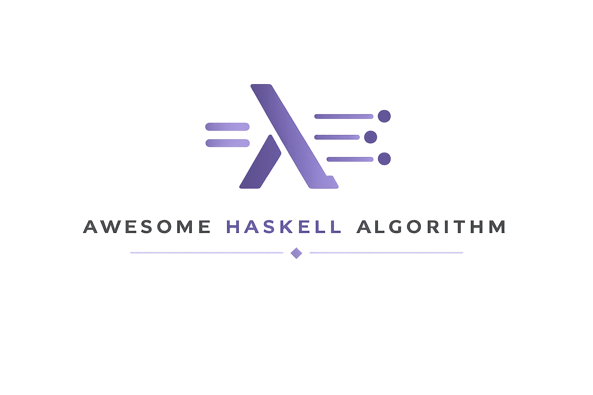

A repository implementing basic algorithms in Haskell.

## ToC

- [Data Structure](./data_structure/README.md)
  - [Stack](./data_structure/stack_/)
  - [Hash Table](./data_structure/hash/)
  - [Tree](./data_structure/tree/)
    - [Set(balanced binary tree)](./data_structure/tree/Set.hs): Set is balanced binary tree, with reference to [Functional Pearls Efficient sets—a balancing act](https://www.cambridge.org/core/journals/journal-of-functional-programming/article/functional-pearls-efficient-setsa-balancing-act/0CAA1C189B4F7C15CE9B8C02D0D4B54E) and [Haskell Data.Set.Internal](https://hackage-content.haskell.org/package/containers-0.8/docs/src/Data.Set.Internal.html)
- [Search](./search/README.md)
  - [Linear Search](./search/linear_search/)
  - [Binary Search](./search/binary_search/)
  - [Binary Search Tree (BST)](./search/bst.hs)
  - [Depth First Search](./search/depthFirstSearch.hs)
- [Sort](./sort/README.md)
  - [Bubble Sort](./sort/bubbleSort.hs)
  - [Insertion Sort](./sort/insert_sort/)
  - [Selection Sort](./sort/selection_sort/)
  - [Merge Sort](./sort/merge_sort/)
  - [Quick Sort](./sort/quick_sort/)
  - [Shell Sort](./sort/shell_sort/)
  - [Counting Sort](./sort/counting_sort/)
- [Math](./math/README.md)
  - [Euclidean Algorithm](./math/euclidean.hs): GCD(Greatest Common Divisor), LCM(Least Common Multiple)
  - [prime number](./math/prime_number/)
    - 
  - [Fermat's Little Theorem](./math/fermat.hs)
  - [Fibonacci](./math/fibonacci/)
  - [Pi Approximation](./math/pi.hs)

### Paper Implmentation

- [Why Functional Programming Matters](./WhyFunctionalProgrammingMatters/README.md): Rewrote the sample code from paper in Haskell.

---

## ENVIRONMENT

- [Nix Flake](https://nixos.wiki/wiki/Flakes)
- [Haskell](https://www.haskell.org/)
  - [GHC](https://www.haskell.org/ghc/)

In detail, see [flake.nix](./flake.nix).

---

## Reference

- [Why Haskell matters](https://wiki.haskell.org/Why_Haskell_matters)
- [Learn You a Haskell for Great Good! (翻訳: すごいHaskell楽しく学ぼう!)](https://www.ohmsha.co.jp/book/9784274068850/)

---

